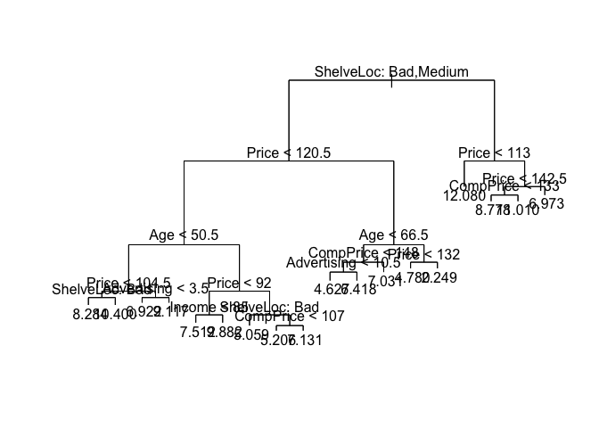
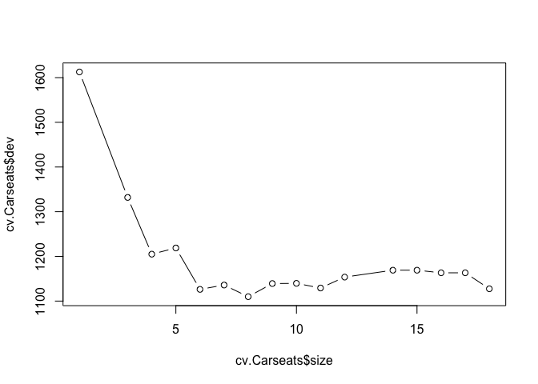
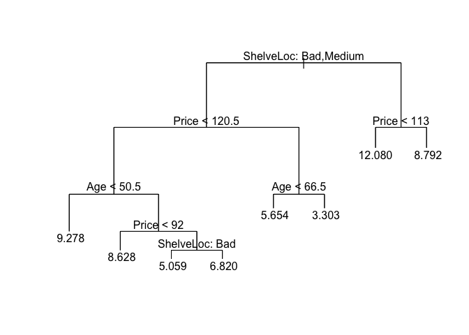

``` r
library(tree)
library(ISLR)
attach(Carseats)
library(randomForest)
```

    ## randomForest 4.6-12

    ## Type rfNews() to see new features/changes/bug fixes.

``` r
Carseats=Carseats
set.seed(1)
```

Question 8 From Chapter 8
-------------------------

#### (a)

##### Split the data set into a training set and a test set.

``` r
set.seed(1)
train = sample(1:nrow(Carseats), nrow(Carseats)/2)
test=Carseats[-train ,"Sales"]
```

#### (b)

##### Fit a regression tree to the training set. Plot the tree, and inter- pret the results. What test error rate do you obtain?

``` r
set.seed(1)
tree.Carseats=tree(Sales~.,Carseats ,subset=train)
summary(tree.Carseats)
```

    ## 
    ## Regression tree:
    ## tree(formula = Sales ~ ., data = Carseats, subset = train)
    ## Variables actually used in tree construction:
    ## [1] "ShelveLoc"   "Price"       "Age"         "Advertising" "Income"     
    ## [6] "CompPrice"  
    ## Number of terminal nodes:  18 
    ## Residual mean deviance:  2.36 = 429.5 / 182 
    ## Distribution of residuals:
    ##    Min. 1st Qu.  Median    Mean 3rd Qu.    Max. 
    ## -4.2570 -1.0360  0.1024  0.0000  0.9301  3.9130

``` r
plot(tree.Carseats)
text(tree.Carseats ,pretty=0)
```



``` r
yhat=predict(tree.Carseats ,newdata=Carseats[-train ,])
mean((yhat-test)^2)
```

    ## [1] 4.148897

``` r
sqrt(mean((yhat-test)^2))
```

    ## [1] 2.036884

-   The mean squared error test rate is 4.148, and the RMSE is 2.036, which is fairly decent. The variable with the most information for sales is shelvloc: bad/medium which is shown from the plot of the tree.

#### (c)

##### Use cross-validation in order to determine the optimal level of tree complexity. Does pruning the tree improve the test error rate?

``` r
set.seed(1)

cv.Carseats=cv.tree(tree.Carseats,FUN=prune.tree )
plot(cv.Carseats$size ,cv.Carseats$dev ,type='b')
```



``` r
prune.Carseats=prune.tree(tree.Carseats ,best=8)
plot(prune.Carseats)
text(prune.Carseats ,pretty=0)
```



``` r
yhat=predict(prune.Carseats ,newdata=Carseats[-train ,])
mean((yhat-test)^2)
```

    ## [1] 5.09085

``` r
sqrt(mean((yhat-test)^2))
```

    ## [1] 2.256291

-   The test RMSE is 2.256, which actually increases marginally, but the tree is much more interpret-able with only 8 terminal nodes.

#### (d)

##### Use the bagging approach in order to analyze this data. What test error rate do you obtain? Use the importance() function to determine which variables are most important.

``` r
set.seed(1)

bag.car=randomForest(Sales~.,data=Carseats,subset=train,mtry=10,importance =TRUE)
bag.car
```

    ## 
    ## Call:
    ##  randomForest(formula = Sales ~ ., data = Carseats, mtry = 10,      importance = TRUE, subset = train) 
    ##                Type of random forest: regression
    ##                      Number of trees: 500
    ## No. of variables tried at each split: 10
    ## 
    ##           Mean of squared residuals: 2.825834
    ##                     % Var explained: 62.98

``` r
yhat=predict(bag.car ,newdata=Carseats[-train ,])
mean((yhat-test)^2)
```

    ## [1] 2.554292

``` r
sqrt(mean((yhat-test)^2))
```

    ## [1] 1.598215

``` r
importance(bag.car)
```

    ##               %IncMSE IncNodePurity
    ## CompPrice   14.032030    129.568747
    ## Income       5.523038     75.448682
    ## Advertising 13.571285    131.246840
    ## Population   1.968853     63.042648
    ## Price       56.863812    504.158108
    ## ShelveLoc   44.720455    323.055042
    ## Age         22.225468    194.915976
    ## Education    4.823966     40.810991
    ## Urban       -1.902185      8.746566
    ## US           6.632887     14.599565

-   The test RMSE is 1.59 which is substantially better than the previous tree models. The top 3 most important variables are shelveloc, price, and age.

#### (e)

##### Use random forests to analyze this data. What test error rate do you obtain? Use the importance() function to determine which variables are most important. Describe the effect of m, the num- ber of variables considered at each split, on the error rate obtained.

``` r
set.seed(1)

bag.car=randomForest(Sales~.,data=Carseats,subset=train,mtry=3,importance =TRUE)
bag.car
```

    ## 
    ## Call:
    ##  randomForest(formula = Sales ~ ., data = Carseats, mtry = 3,      importance = TRUE, subset = train) 
    ##                Type of random forest: regression
    ##                      Number of trees: 500
    ## No. of variables tried at each split: 3
    ## 
    ##           Mean of squared residuals: 3.26604
    ##                     % Var explained: 57.21

``` r
yhat=predict(bag.car ,newdata=Carseats[-train ,])
mean((yhat-test)^2)
```

    ## [1] 3.30763

``` r
sqrt(mean((yhat-test)^2))
```

    ## [1] 1.818689

``` r
bag.car=randomForest(Sales~.,data=Carseats,subset=train,mtry=5,importance =TRUE)
bag.car
```

    ## 
    ## Call:
    ##  randomForest(formula = Sales ~ ., data = Carseats, mtry = 5,      importance = TRUE, subset = train) 
    ##                Type of random forest: regression
    ##                      Number of trees: 500
    ## No. of variables tried at each split: 5
    ## 
    ##           Mean of squared residuals: 2.940785
    ##                     % Var explained: 61.47

``` r
yhat=predict(bag.car ,newdata=Carseats[-train ,])
mean((yhat-test)^2)
```

    ## [1] 2.814854

``` r
sqrt(mean((yhat-test)^2))
```

    ## [1] 1.677753

``` r
bag.car=randomForest(Sales~.,data=Carseats,subset=train,mtry=7,importance =TRUE)
bag.car
```

    ## 
    ## Call:
    ##  randomForest(formula = Sales ~ ., data = Carseats, mtry = 7,      importance = TRUE, subset = train) 
    ##                Type of random forest: regression
    ##                      Number of trees: 500
    ## No. of variables tried at each split: 7
    ## 
    ##           Mean of squared residuals: 2.881145
    ##                     % Var explained: 62.25

``` r
yhat=predict(bag.car ,newdata=Carseats[-train ,])
mean((yhat-test)^2)
```

    ## [1] 2.676364

``` r
sqrt(mean((yhat-test)^2))
```

    ## [1] 1.63596

``` r
bag.car=randomForest(Sales~.,data=Carseats,subset=train,mtry=9,importance =TRUE)
bag.car
```

    ## 
    ## Call:
    ##  randomForest(formula = Sales ~ ., data = Carseats, mtry = 9,      importance = TRUE, subset = train) 
    ##                Type of random forest: regression
    ##                      Number of trees: 500
    ## No. of variables tried at each split: 9
    ## 
    ##           Mean of squared residuals: 2.894683
    ##                     % Var explained: 62.07

``` r
yhat=predict(bag.car ,newdata=Carseats[-train ,])
mean((yhat-test)^2)
```

    ## [1] 2.592225

``` r
sqrt(mean((yhat-test)^2))
```

    ## [1] 1.610039

``` r
importance(bag.car)
```

    ##                %IncMSE IncNodePurity
    ## CompPrice   13.8613559    130.399757
    ## Income       5.0714754     78.546932
    ## Advertising 15.8484911    129.797525
    ## Population  -0.5814597     62.100670
    ## Price       52.8140381    506.176451
    ## ShelveLoc   44.6158853    312.876187
    ## Age         22.9423123    193.642513
    ## Education    3.6120385     42.302945
    ## Urban       -2.5805163      8.201527
    ## US           6.4404356     14.613714

-   As the number of variables in the random forest model increases(mtry) at each split, the lower the test RMSE gets, which indicates that this data needs more complex trees for predictive power. The Random forest is marginally better than the bagging model in the previous question which used all 10 variables. The variables which were most important were shelveloc, price, and age which were the same variables in the previous bagging problem.
